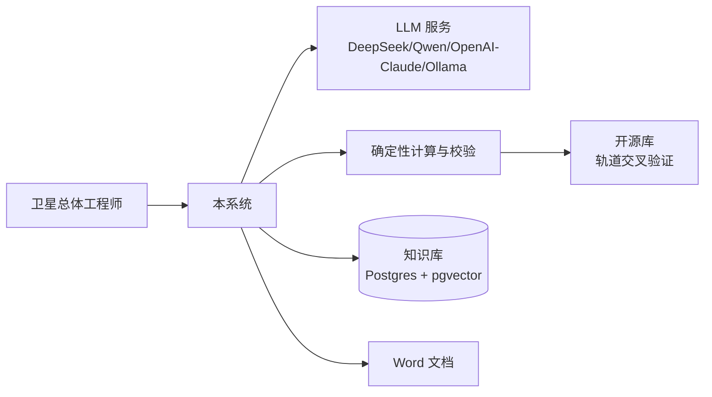
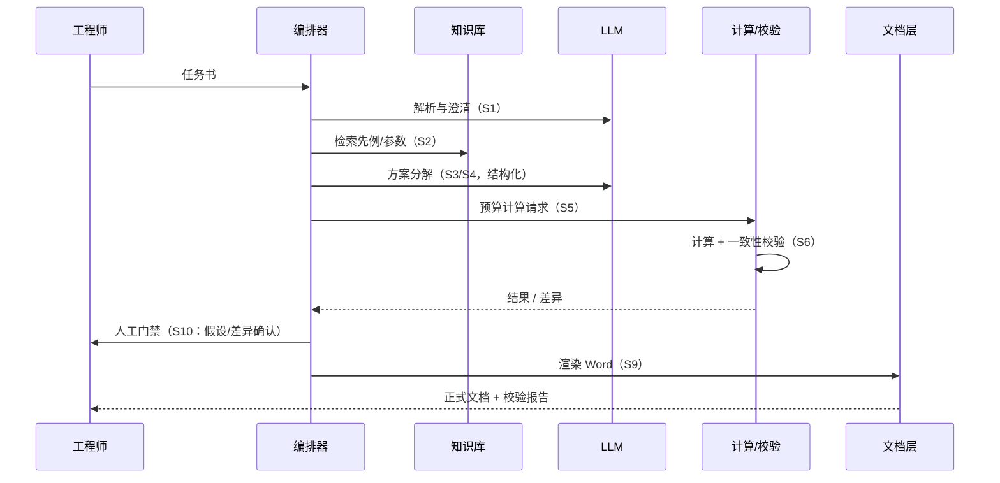

# 02 总体设计

| 项目 | 内容 |
|---|---|
| 状态 | 初稿 |
| 优先级 | P0 |
| 负责人 | 待定 |
| 最后更新 | 2026-10-05 |
| 关联文档 | [01 范围](./01-scope-requirements.md) · [03 数据模型](./03-data-model.md) · [05 编排](./05-agent-orchestration.md) · [06 校验](./06-calculation-verification.md) |

> 本文档是系统的「骨架」，重点写清模块边界与关键取舍。

## 1. 系统上下文



- 上游：工程师 / 任务书；外部服务：LLM 供应商（ADR-0002）
- 下游 / 消费者：工程师（Word + Trace + 校验报告）、评审演示

## 2. 设计原则

1. **数字不经过 LLM**：所有数值只能来自确定性计算器或显式假设（[03](./03-data-model.md)）。
2. **一切可追溯**：每个数字可追到计算记录、文档引用或人工确认记录。
3. **人工门禁不可跳过**：假设确认、校验失败处置必须由工程师决策。
4. **LLM 只做语言与推理**：理解需求、澄清、组织方案、撰写叙述；不做算术、不做事实断言。
5. **专业的事交给专业路径**：轨道等专业计算走明确实现 + 开源库交叉验证（ADR-0004），不拍脑袋。

## 3. 模块划分与边界

| # | 能力 | 归属 | 理由 | 实现位置 |
|---|---|---|---|---|
| 1 | 任务书理解 / 需求澄清 | LLM | 自然语言归纳 | S1（[05](./05-agent-orchestration.md)） |
| 2 | 方案分解（构型/分系统/指标树） | LLM + 规则校验 | LLM 生成草案，结构与 id 由规则约束 | S3 |
| 3 | 数值估算（质量/功耗/数据量/链路） | 确定性程序 | 算术必须可复算 | S5 / [06](./06-calculation-verification.md) |
| 4 | 轨道与覆盖分析 | 自研简化模型 + 库交叉验证 | 覆盖逻辑贴合需求；校验路径独立 | C5（ADR-0004） |
| 5 | 器件与配置候选推荐 | 检索 + 规则 | 基于知识库与约束筛选，只读 | [04](./04-knowledge-base.md) |
| 6 | 一致性 / 预算闭合校验 | 确定性程序 | 独立校验路径 | S6 / V1~V7 |
| 7 | 风险分析 | LLM 起草 + 案例库检索 | 参考 LLIS 历史教训 | S8 + kb.search |
| 8 | 文档叙述与成稿 | LLM（仅叙述） | 数字来自 IR，LLM 只写文字 | S8 / [10](./10-doc-generation.md) |
| 9 | 假设确认 / 冲突处置 | 人工门禁 | 责任边界 | S10 |

## 4. 端到端数据流



## 5. 分层架构

| 层 | 职责 | 技术选型 |
|---|---|---|
| 交互层 | 任务输入、进度、评审门禁、Trace | React 18 + TS + Vite + Ant Design 5（[09](./09-frontend.md)） |
| 编排层 | 状态机（S1~S10）、工具调度、trace | FastAPI + 自研轻量状态机（ADR-0001） |
| 能力层 | 计算工具、检索工具、渲染工具、LLM 适配 | `app/tools/*`、`app/providers/*`（[05](./05-agent-orchestration.md)） |
| 数据层 | 参数 IR、预算、校验记录、向量库 | Postgres 16 + pgvector，SQLAlchemy + Alembic（ADR-0003） |
| 文档层 | 模板渲染、出处标注 | docxtpl（ADR-0005） |

## 6. 失败模式与降级

| 失败 | 检测方式 | 处理 |
|---|---|---|
| LLM 超时 / 限流 | 调用层 | 指数退避重试 → 供应商降级链 → 中断并报告 |
| 结构化输出解析失败 | Pydantic / JSON Schema | 修复重试 ≤ 2 次 → 转人工（S10） |
| 数值校验不过 | 校验引擎（S6） | block：冻结参数、差异报告、禁入文档、转门禁 |
| 检索无结果 | 检索层 | 输出「无依据」，禁止编造，转人工确认 |
| 单位缺失 / 冲突 | 校验引擎 V1 | 拒绝入库 |
| 渲染占位符缺失 | 渲染前置扫描（S9） | 报错并阻止导出 |

## 7. 非功能设计

- 性能：单任务端到端 ≤ 10 分钟；单步 LLM ≤ 120 秒
- 成本：单任务 ≤ ¥3；trace 记录 tokens 与估算成本，80% 告警
- 可观测：每步 trace 落 jsonl（格式见 [05](./05-agent-orchestration.md) 第 6 节）
- 可复现：语料 manifest + 模型版本 + 提示词版本 + seed 固定

## 8. 代码目录

```
app/                # 后端（FastAPI）
  api/              # 对外接口（对应 07）
  orchestrator/     # 状态机 S1~S10
  steps/            # 每步实现
  tools/            # calc / kb / doc 工具
  validation/       # 校验引擎 V1~V7
  providers/        # LLM 适配层（ADR-0002）
  models/           # ORM 模型
web/                # 前端（React）
prompts/            # 提示词（版本化）
specs/              # openapi.yaml + JSON Schemas
templates/          # Word 模板（docxtpl）
corpus/             # raw / synthetic / manifest.csv
artifacts/          # 生成的 Word、trace.jsonl、校验报告
scripts/            # make 脚本入口
tests/              # 测试（对应 11）
docs/               # 本文档集
```

## 9. 关键取舍

| 决策 | 备选 | 理由 | ADR |
|---|---|---|---|
| Python + FastAPI + 自研状态机 | Node / Django / Agent 框架 | 生态 + 流程可控 | [0001](./adr/0001-tech-stack.md) |
| 多供应商 LLM 适配层 | 单一供应商 | 降级与离线演示 | [0002](./adr/0002-llm-services.md) |
| Postgres + pgvector | SQLite + Chroma / 独立向量库 | 单组件、同库过滤 | [0003](./adr/0003-storage.md) |
| 自研轨道模型 + 库交叉验证 | 高保真库主路径 | 校验独立、依赖轻 | [0004](./adr/0004-orbit-computation.md) |
| docxtpl | python-docx / pandoc | 模板可由工程师维护 | [0005](./adr/0005-doc-engine.md) |
