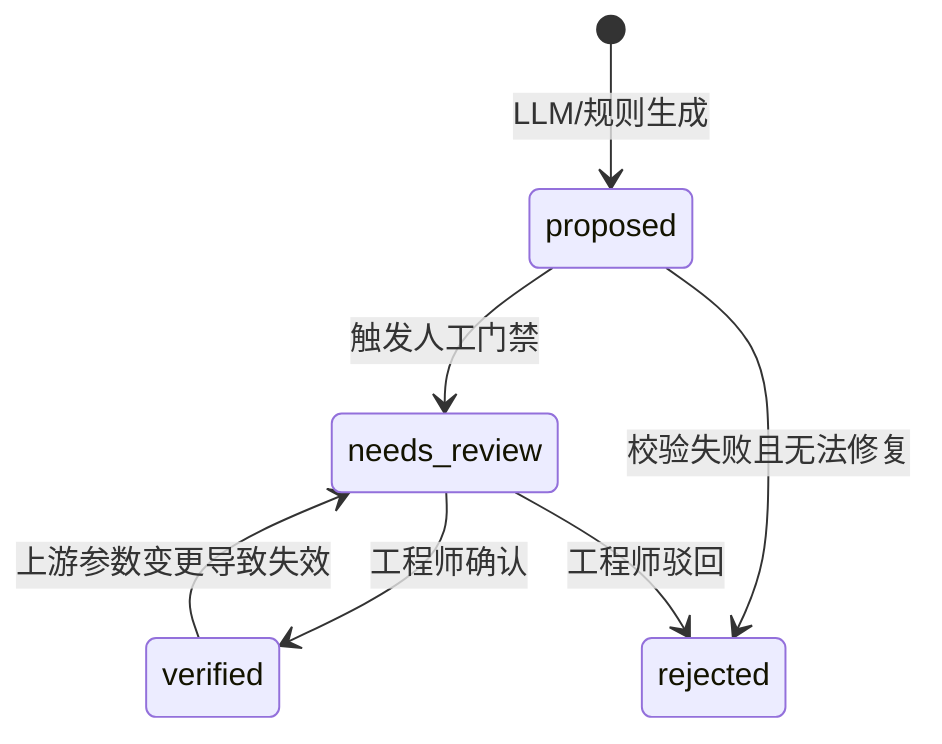

# 03 设计参数数据模型（IR）

| 项目 | 内容 |
|---|---|
| 状态 | 细化 |
| 优先级 | P0 |
| 负责人 | 待定 |
| 最后更新 | 2026-10-05 |
| 关联文档 | [02 总体设计](./02-overall-design.md) · [06 校验](./06-calculation-verification.md) · [08 存储](./08-storage.md) · [07 接口](./07-api.md) |

> 本文档是全系统的**数据脊椎**：LLM 输出、计算器、校验器、Word 渲染全部围绕它。原则：**每个数字必须可追溯、单位显式、假设显式**。
> 单一事实源：JSON Schema 文件（`specs/schemas/`）；本文件写字段语义、约束与示例。

## 1. 设计原则

1. 任何数值必须携带来源（计算 / 文档 / 目录 / 假设 / 人工）。
2. 单位显式且统一（SI 为主），禁止裸数字。
3. 假设是一等公民：显式登记、可被人工确认或推翻。
4. 参数有生命周期状态，未经「已验证」的数字不得进入正式文档。
5. 所有对象带版本与时间戳，支持审计与回放。

## 2. Schema 文件与版本策略

| 文件 | 对应实体 |
|---|---|
| `specs/schemas/mission-request.schema.json` | MissionRequest |
| `specs/schemas/system-design.schema.json` | SystemDesign |
| `specs/schemas/design-parameter.schema.json` | DesignParameter |
| `specs/schemas/budget.schema.json` | Budget / BudgetItem |
| `specs/schemas/calculation-record.schema.json` | CalculationRecord |
| `specs/schemas/validation-result.schema.json` | ValidationResult |
| `specs/schemas/assumption.schema.json` | Assumption |
| `specs/schemas/component-candidate.schema.json` | ComponentCandidate |
| `specs/schemas/citation.schema.json` | Citation |
| `specs/schemas/review-gate.schema.json` | ReviewGate |
| `specs/schemas/tools/*.json` | 内部工具契约（[07](./07-api.md) §6） |

- 规范：JSON Schema draft 2020-12；`additionalProperties: false`（防字段漂移）
- 版本：初版 `v1`；破坏性变更升 major 并在此登记迁移说明；新增可选字段属兼容变更

## 3. 实体定义

### 3.1 MissionRequest（任务书）

| 字段 | 类型 | 必填 | 约束 | 说明 |
|---|---|---|---|---|
| `goal` | string | ✅ | 1~2000 | 任务目标 |
| `constraints.orbit_type` | enum | ❌ | `SSO/LEO/GEO/custom` | 轨道类型 |
| `constraints.altitude_km` | number | ❌ | 200~36000 | 轨道高度 |
| `constraints.inclination_deg` | number | ❌ | 0~180 | 倾角 |
| `constraints.lifetime_years` | number | ❌ | 0.5~20 | 卫星寿命 |
| `constraints.payload` | string | ❌ | ≤500 | 载荷参数描述 |
| `constraints.data_requirements` | string | ❌ | ≤500 | 成像 / 通信任务需求 |
| `constraints.ttc_conditions` | string | ❌ | ≤500 | 测控条件 |
| `constraints.mass_limit_kg` | number | ❌ | >0 | 整星质量上限 |
| `constraints.power_limit_w` | number | ❌ | >0 | 整星功耗上限 |
| `constraints.notes` | string | ❌ | ≤1000 | 其他约束 |
| `clarifications` | array | ❌ | `[{question, answer, asked_at}]` | S1 澄清记录（≤3 轮） |
| `language` | string | ❌ | 固定 `zh` | 输出语言 |
| `created_at` | datetime | ✅ | ISO 8601 UTC | |

```json
{
  "goal": "设计一颗 500km SSO 光学遥感小卫星",
  "constraints": {
    "orbit_type": "SSO", "altitude_km": 500, "inclination_deg": 97.4,
    "lifetime_years": 3, "payload": "多光谱相机，地面分辨率 5m，幅宽 60km",
    "data_requirements": "每日成像 10 圈", "ttc_conditions": "S 频段测控，国内站",
    "mass_limit_kg": 80, "notes": "尽量采用货架产品"
  },
  "clarifications": [],
  "language": "zh",
  "created_at": "2026-10-05T09:00:00Z"
}
```

### 3.2 SystemDesign（整星方案）

| 字段 | 类型 | 必填 | 说明 |
|---|---|---|---|
| `configuration.type` | string | ✅ | 构型类型（如 `3-axis-stabilized`） |
| `configuration.envelope_mm` | `{x,y,z}` | ✅ | 包络尺寸（毫米） |
| `configuration.notes` | string | ❌ | 构型说明（叙述由 S8 撰写） |
| `subsystems` | array | ✅ | `[{name, module, description, status}]`；`module` 用枚举（见 [07](./07-api.md) §1.4） |
| `metrics` | array | ✅ | `[{param_id, target_value, unit}]` 指标树叶子 |
| `version` / `created_at` | int / datetime | ✅ | 版本与时间 |

### 3.3 DesignParameter（核心对象）

| 字段 | 类型 | 必填 | 说明 |
|---|---|---|---|
| `id` | string | ✅ | `<分系统>.<对象>[.<子项>]`，如 `power.sa.area` |
| `name` / `name_en` | string | ✅ | 与 [术语表](./14-glossary.md) 一致 |
| `value` | number | ✅ | 数值 |
| `unit` | string | ✅ | 单位枚举（§4） |
| `source_type` | enum | ✅ | `calc/doc/catalog/assumption/human` |
| `source_ref` | string | ✅ | CalculationRecord / Citation / Assumption / 人工记录 id |
| `margin` | number / null | ❌ | 余量（绝对值或百分比，注明口径） |
| `confidence` | enum | ❌ | `high/medium/low`，默认 `medium` |
| `status` | enum | ✅ | `proposed/needs_review/verified/rejected` |
| `parent` | string / null | ✅ | 父参数 id（指标树） |
| `derived_from` | string[] | ❌ | 上游参数 id 列表（用于失效联动） |
| `upstream_hash` | string | ❌ | 生成时上游参数快照 hash（陈旧检测，ADV-06） |
| `version` | int | ✅ | 每次变更 +1 |
| `created_at` / `updated_at` | datetime | ✅ | |

**示例**

```json
{
  "id": "power.sa.area", "name": "太阳翼面积", "name_en": "Solar Array Area",
  "value": 4.8, "unit": "m2",
  "source_type": "calc", "source_ref": "calc-20261005-0007",
  "margin": 0.10, "confidence": "high", "status": "verified",
  "parent": "power.sa", "derived_from": ["power.p_eol_w", "eps.cell_efficiency"],
  "upstream_hash": "sha256:9f2c…", "version": 3,
  "created_at": "2026-10-05T09:10:00Z", "updated_at": "2026-10-05T09:32:00Z"
}
```

**拒绝规则（V1 强制）**

1. `status != verified` 不得渲染进正式 Word（`warn` 获人工确认后放行）；
2. `source_type` / `source_ref` / `unit` 缺失或非法 → 校验失败；
3. `derived_from` 的上游参数变更时，`upstream_hash` 不一致 → 自动置 `needs_review`。

### 3.4 Budget / BudgetItem（预算）

**Budget**：

| 字段 | 类型 | 必填 | 说明 |
|---|---|---|---|
| `id` / `mission_id` | string | ✅ | |
| `budget_type` | enum | ✅ | `mass/power/data/link` |
| `summary_rule` | enum | ✅ | `sum`（求和）/ `max`（取最大）/ `race`（竞态） |
| `total_value` / `total_unit` | number / string | ✅ | 汇总值与单位 |
| `margin_pct` | number | ❌ | 汇总余量口径 |
| `items` | BudgetItem[] | ✅ | 行项目 |
| `status` / `created_at` | enum / datetime | ✅ | |

**BudgetItem**：

| 字段 | 类型 | 必填 | 说明 |
|---|---|---|---|
| `name` | string | ✅ | 行项目名（如「姿控分系统」） |
| `param_id` | string | ❌ | 关联参数 id |
| `value` / `unit` | number / string | ✅ | |
| `margin` | number | ❌ | 行级余量 |
| `source_ref` | string | ✅ | 计算记录 / 引用 |
| `note` | string | ❌ | |

```json
{
  "id": "budget-mass-t-20261005-001", "mission_id": "t-20261005-001", "budget_type": "mass",
  "summary_rule": "sum", "total_value": 72.4, "total_unit": "kg", "margin_pct": 0.20,
  "items": [
    { "name": "有效载荷", "param_id": "payload.mass", "value": 18.0, "unit": "kg",
      "margin": 0.1, "source_ref": "calc-20261005-0003" }
  ],
  "status": "verified", "created_at": "2026-10-05T09:03:00Z"
}
```

### 3.5 CalculationRecord（计算记录）

| 字段 | 类型 | 必填 | 说明 |
|---|---|---|---|
| `id` | string | ✅ | `calc-YYYYMMDD-NNNN` |
| `mission_id` | string | ✅ | |
| `tool` | string | ✅ | 如 `calc.eps` / `calc.mass_budget` |
| `formula_version` | string | ✅ | 公式版本（与 [06](./06-calculation-verification.md) 对应） |
| `inputs` / `outputs` | object | ✅ | 完整输入 / 输出（含单位映射 `units_map`） |
| `code_commit` | string | ✅ | 代码版本（可复现） |
| `duration_ms` | int | ❌ | |
| `created_at` | datetime | ✅ | |

```json
{ "id": "calc-20261005-0007", "mission_id": "t-20261005-001", "tool": "calc.eps",
  "formula_version": "eps-v1",
  "inputs": { "power.p_eol_w": 210.5, "cell_efficiency": 0.30, "sun_angle_deg": 0 },
  "units_map": { "power.p_eol_w": "W", "power.sa.area": "m2" },
  "outputs": { "power.sa.area": 4.8 }, "code_commit": "a1b2c3d",
  "duration_ms": 12, "created_at": "2026-10-05T09:03:00Z" }
```

### 3.6 ValidationResult（校验结论）

| 字段 | 类型 | 必填 | 说明 |
|---|---|---|---|
| `id` / `mission_id` | string | ✅ | |
| `rule_id` | enum | ✅ | `V1`~`V7` |
| `status` | enum | ✅ | `pass/warn/block` |
| `param_id` | string | ❌ | 关联参数 |
| `message` | string | ✅ | 人类可读结论 |
| `evidence` | object | ✅ | 规则相关证据（期望/实际/阈值等） |
| `created_at` | datetime | ✅ | |

```json
{ "id": "vr-0018", "mission_id": "t-20261005-001", "rule_id": "V3", "status": "pass",
  "param_id": "mass.total",
  "message": "质量预算闭合（分项和 72.4 kg = 汇总 72.4 kg）",
  "evidence": { "expected": 72.4, "actual": 72.4, "tolerance_pct": 0.5 },
  "created_at": "2026-10-05T09:03:20Z" }
```

### 3.7 Assumption（假设）

| 字段 | 类型 | 必填 | 说明 |
|---|---|---|---|
| `id` / `mission_id` | string | ✅ | |
| `content` | string | ✅ | 假设内容（如「方案期质量余量取 20%」） |
| `basis` | string | ✅ | 依据（文献 / 经验 / 约定） |
| `related_params` | string[] | ✅ | 影响的参数 |
| `status` | enum | ✅ | `open/confirmed/rejected` |
| `registered_by` / `confirmed_by` / `confirmed_at` | string / datetime? | ✅/❌ | 登记与确认记录 |

### 3.8 ComponentCandidate（选型候选）

| 字段 | 类型 | 必填 | 说明 |
|---|---|---|---|
| `id` / `mission_id` | string | ✅ | |
| `name` / `category` | string | ✅ | 器件名 / 类别（如 `reaction_wheel`） |
| `module` | enum | ✅ | 分系统 |
| `specs` | object | ✅ | 关键参数键值（含单位） |
| `citations` | Citation[] | ✅ | **必须带来源**，无来源候选不得输出 |
| `status` | enum | ✅ | `suggested`（本期只读） |

### 3.9 Citation（引用）

| 字段 | 类型 | 必填 | 说明 |
|---|---|---|---|
| `doc_id` / `chunk_id` | string | ✅ | 语料标识 |
| `title` | string | ✅ | 文档标题 |
| `source_url` | string | ✅ | 原文链接 |
| `page` | int | ❌ | 页码 |
| `module` | enum | ❌ | 分系统 |
| `is_synthetic` | boolean | ✅ | 合成语料标记 |
| `license` | string | ✅ | 许可标识 |

### 3.10 ReviewGate（门禁记录）

| 字段 | 类型 | 必填 | 说明 |
|---|---|---|---|
| `id` / `mission_id` | string | ✅ | `g-NNN` |
| `type` | enum | ✅ | `assumption_confirm/discrepancy_resolve/final_review` |
| `param_id` | string | ❌ | 关联参数 |
| `action` | enum | ✅ | `accept/reject` |
| `reviewer` / `comment` / `ts` | string / datetime | ✅ | 审计字段 |

## 4. 单位枚举与换算

| 维度 | 单位 |
|---|---|
| 质量 | kg, g |
| 长度 / 面积 | m, mm, km, m2 |
| 功率 / 能量 | W, kW, Wh, V, Ah |
| 时间 | s, min, h, day, year |
| 数据 | bit, Gb, Gb/day, Mbps |
| 链路 | dB, dBW, dBi, dB/K, Hz, GHz |
| 力学 | N, N·m, N·m·s, kg·m2 |
| 角度 / 比例 | deg, %, ppm |

- 换算集中在 `app/tools/calc/units.py`；任何跨单位计算必须显式转换并记录到 `units_map`

## 5. 溯源链（结构化）

```
DesignParameter.source_ref
  ├─ calc   → CalculationRecord（公式版本 / 输入 / 输出 / commit）→ 可独立复算
  ├─ doc    → Citation（doc_id + chunk_id + page + url + is_synthetic）
  ├─ catalog→ 语料 manifest 中的器件条目（含 license）
  ├─ assumption → Assumption（依据 + 确认记录）
  └─ human  → ReviewGate（评审人 + 时间 + 意见）
```

- 链路任一环缺失 → 参数无法进入 `verified`
- 溯源 ID 只可追加，不可修改；导出文档时出处标记由此自动生成（[10](./10-doc-generation.md)）

## 6. 参数状态机（含动作方）

| 迁移 | 触发 | 动作方 |
|---|---|---|
| `proposed → needs_review` | 触发门禁（假设确认 / warn 复核 / block 处置） | 系统 |
| `proposed → rejected` | 校验失败且无法修复 | 系统 |
| `needs_review → verified` | `accept`（可带 `edited_value`） | 人工（A8） |
| `needs_review → rejected` | `reject` | 人工（A8） |
| `verified → needs_review` | 上游参数变更（`upstream_hash` 不一致） | 系统（ADV-06） |



## 7. 版本与审计

- 每次修改记录（`audit_log`）：

```json
{ "entity": "design_parameter", "entity_id": "power.sa.area", "field": "value",
  "before": 5.1, "after": 4.8, "who": "system:S5", "why": "calc-20261005-0007",
  "ts": "2026-10-05T09:32:00Z" }
```

- 支持按任务导出参数快照 `parameters-snapshot.json`（回放 / diff 演示）

## 8. ID 与命名规则汇总

| 对象 | 规则 | 示例 |
|---|---|---|
| 任务 | `t-YYYYMMDD-NNN` | `t-20261005-001` |
| 参数 | `<分系统>.<对象>[.<子项>]` | `power.sa.area` |
| 计算记录 | `calc-YYYYMMDD-NNNN` | `calc-20261005-0007` |
| 校验结论 | `vr-NNNN`（任务内序号） | `vr-0018` |
| 门禁 | `g-NNN`（任务内序号） | `g-003` |
| 语料文档 | `<来源>-<主题>-<版本>` | `sst-soa-2026-pwr` |
| 切片 | `<doc_id>-<chunk 序号>` | `sst-soa-2026-pwr-014` |

## 9. 关键取舍

| 决策 | 备选 | 理由 | ADR |
|---|---|---|---|
| 统一 IR + JSON Schema 单一事实源 | 各模块自定义结构 | 校验 / 渲染 / 回放统一 | [0001](./adr/0001-tech-stack.md) |
| 假设一等公民（显式台账） | 隐含在提示词里 | 拦截与责任边界的前提 | — |
| `derived_from` + `upstream_hash` 做陈旧检测 | 变更后全量重算 | 精准失效、避免无谓重跑 | — |
