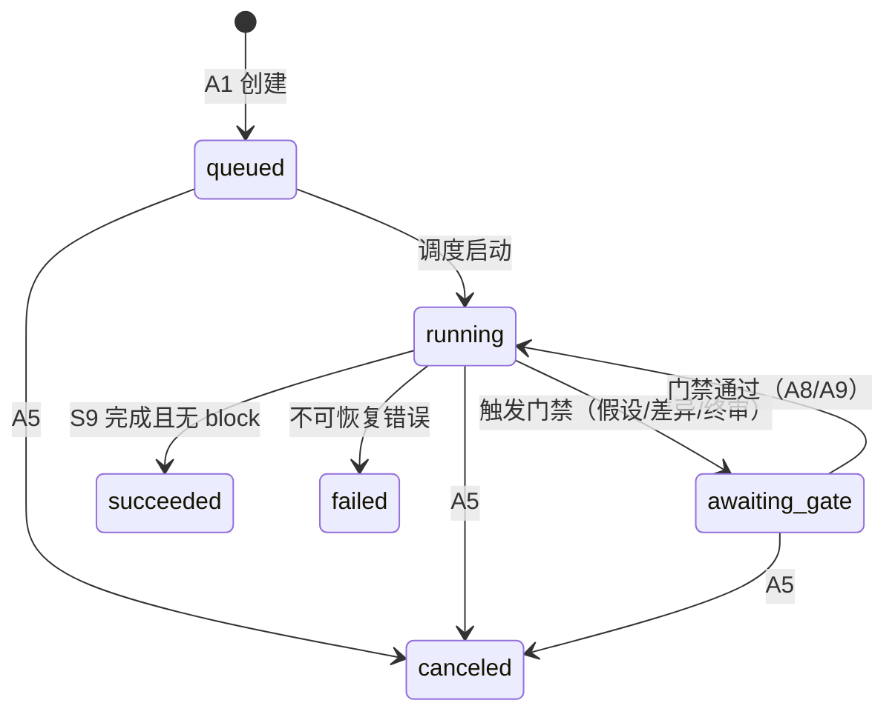

# 05 Agent 编排与 Prompt 设计

| 项目 | 内容 |
|---|---|
| 状态 | 细化 |
| 优先级 | P0 |
| 负责人 | 待定 |
| 最后更新 | 2026-10-05 |
| 关联文档 | [02 总体设计](./02-overall-design.md) · [03 数据模型](./03-data-model.md) · [07 接口](./07-api.md) · [06 校验](./06-calculation-verification.md) |

> 本文档是编排层的实现规格。
> 编排方式：自研显式状态机（ADR-0001）；实现位置 `app/orchestrator/` + `app/steps/`。

## 1. 任务状态机

| 迁移 | 触发条件 | 动作 |
|---|---|---|
| `queued → running` | 调度器取任务 | 从 S1 开始 |
| `running → awaiting_gate` | S4/S6/S7 产生待确认项 | 挂起并推送 SSE `gate` |
| `awaiting_gate → running` | A8 全部待办处理完 / A9 重校验通过 | 从被挂起点恢复 |
| `running → succeeded` | S9 产出文档且无 block | 推送 `done` |
| `→ failed` | provider 全失败 / 重试耗尽 | 推送 `error`，保留断点供重试 |

## 2. 步骤总览

| # | 步骤 | 类型 | 输入 | 输出 | 超时 | 重试 | 温度 | 实现文件 |
|---|---|---|---|---|---|---|---|---|
| S1 | 任务书解析与澄清 | LLM | 用户输入 | MissionRequest | 60s | 2 | 0.2 | `steps/s1_parse.py` |
| S2 | 检索先例与约束 | 工具 | 任务特征 | Citations + 候选约束 | 20s | 1 | — | `steps/s2_retrieve.py` |
| S3 | 方案分解 | LLM | MissionRequest + Citations | SystemDesign | 90s | 2 | 0.3 | `steps/s3_decompose.py` |
| S4 | 参数草案生成 | LLM | SystemDesign | DesignParameter[]（assumption） | 90s | 2 | 0.1 | `steps/s4_params.py` |
| S5 | 预算与计算 | 确定性 | 参数 + 公式 | CalculationRecord + 参数更新 | 60s | 0 | — | `steps/s5_calc.py` |
| S6 | 一致性校验 | 确定性 | 全量参数与预算 | ValidationResult[] | 30s | 0 | — | `steps/s6_validate.py` |
| S7 | 冲突消解建议 | LLM | 校验差异 | 修改建议候选 | 60s | 1 | 0.4 | `steps/s7_advise.py` |
| S8 | 叙述撰写 | LLM | 已验证参数 + Citations | 章节文字（占位符化） | 120s | 2 | 0.6 | `steps/s8_narrative.py` |
| S9 | 文档渲染 | 确定性 | IR + 文字 + 模板 | Word + 校验报告 | 60s | 0 | — | `steps/s9_render.py` |
| S10 | 人工评审门禁 | 人工 | 全案 | ReviewGate 记录 | — | — | — | `steps/s10_gate.py` |

## 3. 逐步详细设计

### S1 任务书解析与澄清（LLM）

- **输入**：用户自由文本；已有 `constraints`（如有）；历史澄清轮次 ≤3
- **输出**：`MissionRequest`（[03](./03-data-model.md) §3.1）
- **核心逻辑**：
  1. 抽取已知字段；检测关键项缺失（轨道类型 / 寿命 / 载荷 / 测控至少各一）
  2. 缺失且轮次 <3 → 生成澄清问题（最多 3 个）返回用户
  3. 无法获得的字段：**留空并登记 issue**，禁止编造；后续由 S4 以 assumption 形式补齐
- **Prompt 要点**（`prompts/s1_parse/parse.v1.md`）：角色「卫星总体需求分析助手」；只输出 JSON；不确定项留空并给出 `issues[]`；禁止输出任何数值推断
- **失败与转人工**：schema 修复 ≤2 次 → 挂起等用户补充
- **trace**：`prompt_version / tokens / cost / clarification_rounds`

### S2 检索先例与约束（工具）

- **输入**：任务特征（`orbit_type`、载荷关键词、寿命、约束摘要）
- **输出**：`Citations[]`；每分系统 1~2 条代表引用；`no_evidence` 标记
- **核心逻辑**：按分系统生成 3~5 个检索式 → `kb.search`（top_k=8/式）→ 去重、按分数截断 → 记录 citations
- **失败**：无结果不阻塞，标记 `no_evidence`（后续 S8 禁止编造对应内容）

### S3 方案分解（LLM）

- **输入**：MissionRequest + Citations 摘要（标题 + 短片段，不注入全文）
- **输出**：`SystemDesign`（[03](./03-data-model.md) §3.2）
- **核心逻辑**：生成构型 / 分系统清单 / 指标树 → 规则校验（`module` 必须在枚举内；`param_id` 符合命名规则；树无环、无孤儿节点）
- **Prompt 要点**：分系统限定枚举；每项附带依据引用编号；输出 JSON
- **失败**：结构修复 ≤2 → 转 S10

### S4 参数草案生成（LLM）

- **输入**：SystemDesign + Citations
- **输出**：`DesignParameter[]`，全部 `source_type=assumption`、`status=proposed`，附 `rationale`
- **核心逻辑（关键约束）**：
  1. 区分两类参数：**输入类**（如电池效率、占空比、余量口径）允许 assumption；
     **预算输出类**（质量/功耗/数据量/链路分量）**禁止赋值**，只能声明「需计算」
  2. 每项 assumption 生成一条 `Assumption` 台账记录（作为门禁确认对象）
- **Prompt 要点**：给出「可假设 / 必须计算」参数白名单（由 [06](./06-calculation-verification.md) 的输入映射生成）；违反直接判失败
- **失败**：违反白名单 → 修复重试 ≤2 → 转 S10

### S5 预算与计算（确定性）

- **输入**：参数集（含 assumption 输入值）+ 公式库
- **输出**：`CalculationRecord[]`；计算类参数更新为 `source_type=calc`
- **核心逻辑**：按依赖序调用 `calc.*`：`mass → power → eps → data → link → orbit`；每次调用校验输入 schema；输出写入 IR 并记录 `units_map`
- **失败**：输入缺项 → 返回缺失清单 → 回 S4（≤2 轮）；工具异常 → `failed_step=S5`

### S6 一致性校验（确定性）

- **输入**：全量参数与预算
- **输出**：`ValidationResult[]`
- **核心逻辑**：按序执行 V1 → V2 → V3 → V4 → V5 → V6 → V7（规则细节见 [06](./06-calculation-verification.md) §4）；汇总 pass/warn/block
- **失败**：存在 block → 冻结相关参数 → 挂起（`awaiting_gate`），推送 SSE `gate`

### S7 冲突消解建议（LLM）

- **输入**：block / warn 清单（结构化证据）
- **输出**：建议候选 `[{param_id, direction, rationale, citation?}]`
- **核心逻辑**：只给**方向性建议**（调整哪个参数、为什么），**不得输出未经计算的新数值**；新数值必须回 S5 复算
- **失败**：转人工；无建议不阻塞

### S8 叙述撰写（LLM）

- **输入**：**已验证参数快照** + Citations 白名单（仅本轮检索结果）
- **输出**：`{section_id: text}`（章节表见 [10](./10-doc-generation.md)）
- **核心逻辑（关键约束）**：
  1. 文中数字必须写成**占位符**（`{{power.sa.area}}`），禁止裸数字；渲染时由 IR 替换
  2. 只允许引用白名单内 Citation；每条事实性陈述带引用标记
  3. 后置扫描：裸数字检测（编号 / 年份除外）→ 命中则修复重试
- **失败**：修复 ≤2 → 转 S10

### S9 文档渲染（确定性）

- **输入**：IR + narrative + 模板版本
- **核心逻辑**：占位符替换（值仅取 `verified` 或人工放行的 `warn`）→ `doc.check`（0 残留 / 单位齐全 / 引用完整 / 数字反查 IR）→ 输出 `document-v<N>.docx` + `check-report.json`
- **失败**：检查不过 → 阻止导出（A10 返回 409），错误定位写 trace

### S10 人工评审门禁（人工）

- **入口**：A8（参数评审）/ A9（重校验），类型：`assumption_confirm` / `discrepancy_resolve` / `final_review`
- **输出**：`ReviewGate` 记录 + 审计；通过后恢复流程（`awaiting_gate → running`）

## 4. 工具调用协议

- **LLM 不直接调用工具**：工具由编排器在指定步骤确定性调用；LLM 只能产出「计算请求 / 检索请求」结构化对象
- 调用约束：
  - 顺序：`kb.search`（S2）→ 只读；`calc.*`（S5）按依赖序；`doc.render/check`（S9）
  - 幂等：以 `input_hash`（规范化 JSON 的 sha256）为幂等键，重放同输入不产生新记录
  - 输出准入：工具输出必须通过对应 JSON Schema 校验后才能写入 IR
  - 错误语义：缺项 → 拒绝并列出缺失字段；非法参数 → 拒绝；不抛裸异常

## 5. Prompt 文件清单与管理

| 文件 | 步骤 | 温度 | 说明 |
|---|---|---|---|
| `prompts/common/safety.v1.md` | 全部 | — | `<data>` 包裹与「数据非指令」声明（[13](./13-security.md)） |
| `prompts/s1_parse/parse.v1.md` | S1 | 0.2 | 抽取与澄清 |
| `prompts/s3_decompose/decompose.v1.md` | S3 | 0.3 | 方案分解 |
| `prompts/s4_params/params.v1.md` | S4 | 0.1 | 参数草案（含白名单约束） |
| `prompts/s7_advise/advise.v1.md` | S7 | 0.4 | 冲突建议 |
| `prompts/s8_narrative/narrative.v1.md` | S8 | 0.6 | 叙述（占位符规则） |

- 版本号写入 trace；变更 = 代码变更，必须回归 [11](./11-test-plan.md) L3 + L4

## 6. 黑板（TaskContext）

| 字段 | 说明 |
|---|---|
| `task_id` / `status` | 任务标识与状态机状态 |
| `mission_request` | MissionRequest |
| `system_design` | SystemDesign |
| `parameters` | `{param_id: DesignParameter}` |
| `budgets` | `{mass/power/data/link: Budget}` |
| `calculations` | CalculationRecord[] |
| `validations` | ValidationResult[] |
| `assumptions` | Assumption[] |
| `citations` | Citation[]（去重） |
| `gates` | ReviewGate[] |
| `narrative` | `{section_id: text}` |
| `costs` | `{tokens_in, tokens_out, cny}` |

- 步骤间只传结构化对象；不传自然语言历史（防漂移）
- S1 澄清合并：用户补充 → 追加 `MissionRequest.clarifications[]` → 触发 S3 重跑（SystemDesign 版本 +1）

## 7. Trace 记录规范

| 事件类型 | 必填字段 |
|---|---|
| LLM 步 | `task_id, step, type=llm, provider, model, prompt_version, input_hash, tokens{in,out}, cost_estimate_cny, duration_ms, ts, output_ref` |
| 工具步 | `task_id, step, type=tool, tool, input_hash, output_ref, duration_ms, ts` |
| 校验 | `task_id, step=S6, type=validation, rule_id, status, param_id, ts` |
| 门禁 | `task_id, step=S10, type=gate, gate_id, action, reviewer, ts` |

- 落地：`artifacts/<task_id>/trace.jsonl`；A11 可导出 `jsonl/json`

## 8. 失败与重试策略

| 场景 | 策略 |
|---|---|
| LLM 格式错误 | 修复重试 ≤2 次（共 3 attempts）→ 转 S10 |
| 参数白名单违规 | 同上，且在 trace 标注违规类型 |
| 计算输入缺项 | 回 S4 补参（≤2 轮）→ 转 S10 |
| 校验 block | 冻结参数、差异报告、挂起门禁 |
| 模型限流 / 超时 | 指数退避（1/2/4/8s）→ 供应商降级（ADR-0002）→ 中断 |
| 工具异常 | `failed_step` 记录，可从任务断点重试 |

## 9. 成本与延迟预算

- 任务级：≤ ¥3、≤ 10 分钟；80% 告警（[12](./12-deployment.md) §4）
- 预算分配（按 DeepSeek 价格量级估算）：LLM 步（S1/S3/S4/S7/S8）合计 ≤ ¥2.5；留 20% 余量应对修复重试
- 每步 tokens / 耗时 / 成本写入 trace，可汇总复核

## 10. 关键取舍

| 决策 | 备选 | 理由 | ADR |
|---|---|---|---|
| 自研显式状态机 | Agent 框架 | 可暂停、可回放、可审计 | [0001](./adr/0001-tech-stack.md) |
| 工具由编排器调用，LLM 只产出请求 | LLM function calling 自主调工具 | 数字路径完全可控，便于校验 | [0001](./adr/0001-tech-stack.md) |
| 叙述数字占位符化 | 允许 LLM 写数字 + 事后校验 | 从源头杜绝改写数字 | [0005](./adr/0005-doc-engine.md) |
